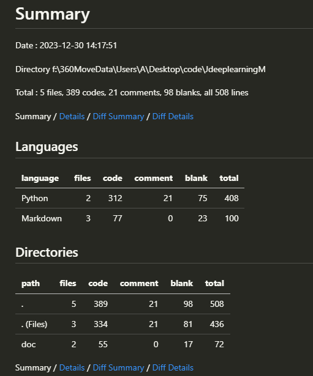
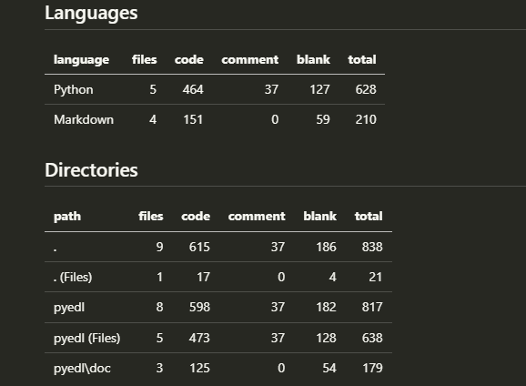

# 更新日志
##    格式:
    普通更新{
    ## 日期
    #### 你干了什么 `版本号`
    解释
    }

## 2023.12.29
#### 项目启动  `0.0.0`     
#### 在`./main.py`中添加`Tensor`类,并有了基础功能 `0.0.1 ` 
>    `data`和加法,加法是前期实验用的重要运算    
#### 为`Tensor`类添加了更多功能,比如一开始的autograd `0.0.2`
>    那时的`autograd`还非常初级,有一个BUG,就是 `backward` 不能多次使用张量 
#### 大更新,完善 `autograd` `0.1.0`
>   修复BUG,autograd机制完善(加法),支持多次使用的张量(添加了许多概念,见`.\doc\file_doc\main.py.md`) 
>预计在0.1.5完善`autograd`
    >>  注:`.\doc\file_doc\main.py.md`已被删除 

---
## 2023.12.30
#### 为`autograd`添加很多方法,具体见 ``./doc/Tensor.md`` `0.1.5`
#### 添加SGD优化器 `0.1.6`
>庆祝代码量破500 
> 
### Pyedl 正式版``1.0.0``宣布完工!!!!!!!
> 只要我不说,你就不知道我调试了8个小时
> 有BUG请反馈至 QQ:2734664632
> 

